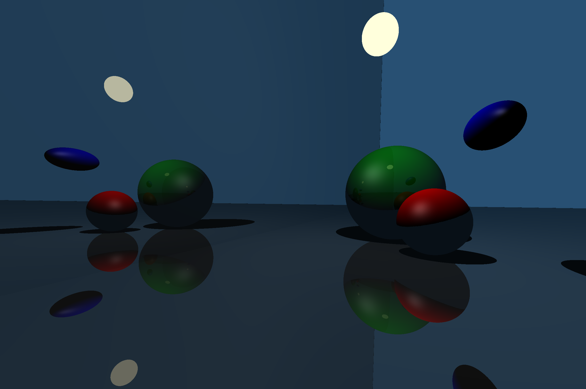

# Simple Raytracing Project

A small C++ project in computer graphics. Implements raytracing from the ground up for primitives including spheres, ellipsoids, planes and arbitrary light-source. Includes dynamic lighting, phong/lambert shading, shadowing, reflections and arbitrary object/camera rotation and movement. Leverages CPU parallelism by default, and achieves a healthy 50fps for the sample simulation. 

